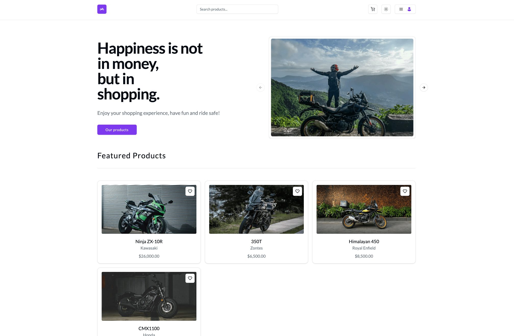
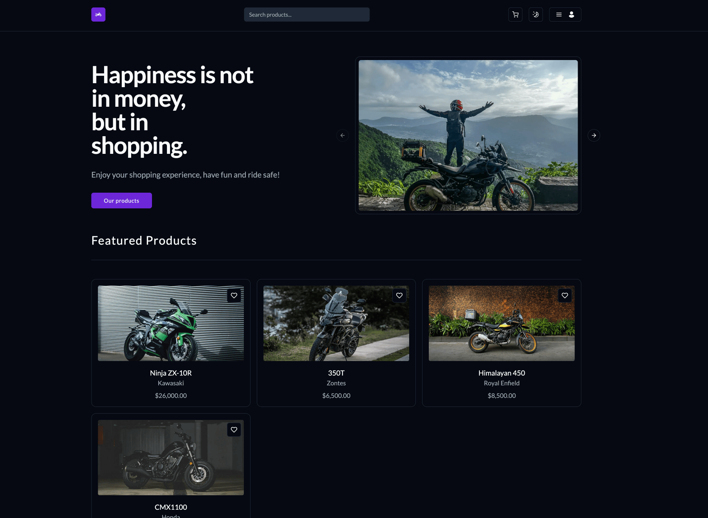
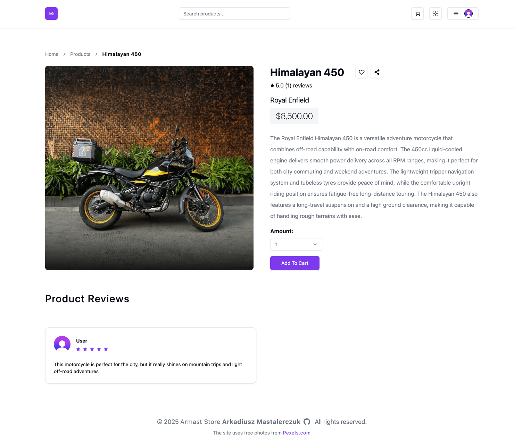
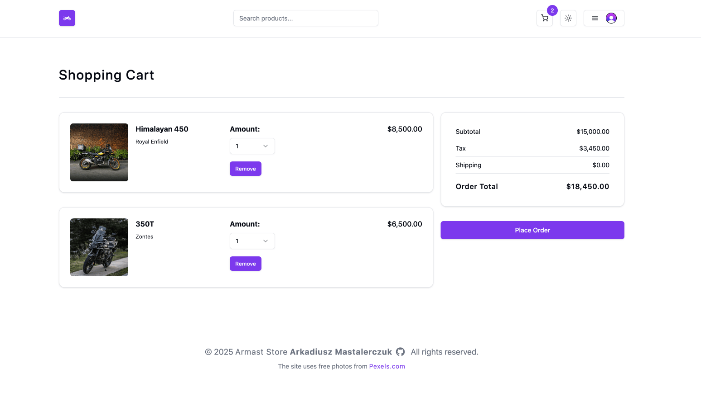
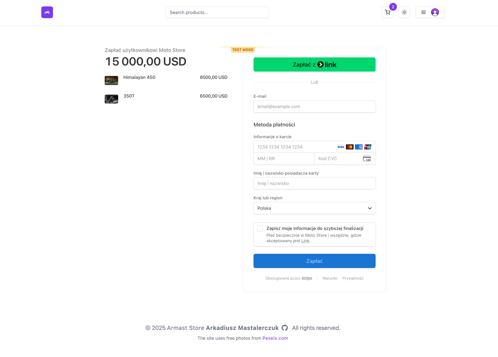
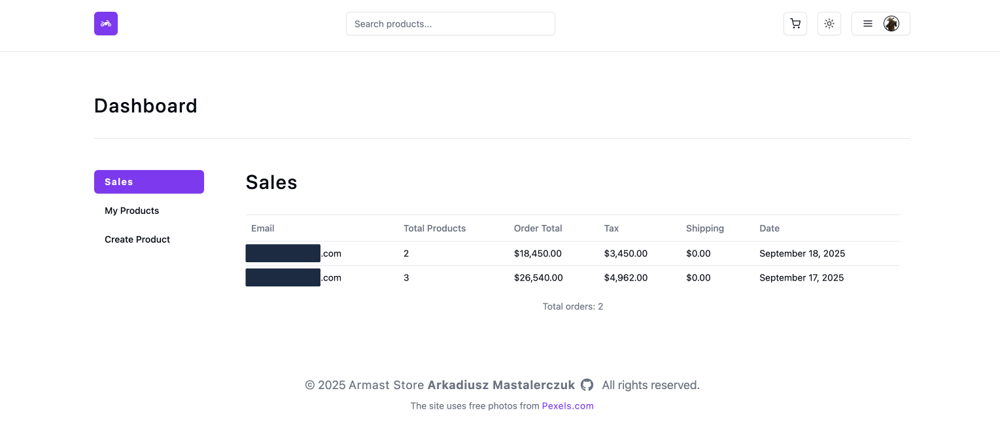

# 🏍️ MotoStore - Motorcycle E-commerce Platform

MotoStore is a cutting-edge e-commerce platform designed specifically for motorcycle enthusiasts. With its sleek and responsive design, users can easily browse through a wide variety of motorcycles, search for specific models, and even peruse detailed product information. The platform offers a seamless shopping experience, complete with a secure checkout process and optimised performance. Whether you're a seasoned rider or just starting your journey, MotoStore is the perfect destination to find your next motorcycle.

[](https://moto-store-sepia.vercel.app/)
[](https://github.com/arekmastalerczuk/moto-store)

## 📸 Screenshots

### 🏠 Main Interface

<div align="center">
  <div style="display: flex; justify-content: space-around; flex-wrap: wrap; gap: 20px; margin: 20px 0;">
    <div style="flex: 1; min-width: 300px; max-width: 48%;">
      <p style="text-align: center; margin: 0 0 8px 0;"><em>☀️ Light Mode</em></p>
      
    </div>
    <div style="flex: 1; min-width: 300px; max-width: 48%;">
      <p style="text-align: center; margin: 0 0 8px 0;"><em>🌙 Dark Mode</em></p>
      
    </div>
  </div>
</div>

### 🛒 Shopping Experience

<div align="center">
  <div style="display: flex; flex-wrap: wrap; justify-content: center; gap: 20px; margin: 30px 0;">
    <div style="flex: 1; min-width: 300px; max-width: 48%;">
      <p style="text-align: center; margin: 0 0 8px 0;"><em>🛍️ Product Details</em></p>
      
    </div>
    <div style="flex: 1; min-width: 300px; max-width: 48%;">
      <p style="text-align: center; margin: 0 0 8px 0;"><em>🛒 Shopping Cart</em></p>
      
    </div>
  </div>
</div>

### 💳 Checkout & Admin

<div align="center">
  <div style="display: flex; flex-wrap: wrap; justify-content: center; gap: 20px; margin: 30px 0;">
    <div style="flex: 1; min-width: 300px; max-width: 48%;">
      <p style="text-align: center; margin: 0 0 8px 0;"><em>💳 Secure Checkout</em></p>
      
    </div>
    <div style="flex: 1; min-width: 300px; max-width: 48%;">
      <p style="text-align: center; margin: 0 0 8px 0;"><em>📊 Admin Dashboard</em></p>
      
    </div>
  </div>
</div>

## ✨ Features

- 🛒 Intuitive product browsing
- 🔍 Search functionality
- 🏷️ Product detailed views
- 🛒 Shopping cart functionality
- 🔐 Secure checkout process
- 📱 Responsive design
- ⚡ Optimized performance

## 🛠️ Tech Stack

- **Framework**: [Next.js](https://nextjs.org/) 14 (React 18) with [TypeScript](https://www.typescriptlang.org/)
- **Styling**:
  - [Tailwind CSS](https://tailwindcss.com/) with [shadcn/ui](https://ui.shadcn.com/) components
  - `tailwind-merge` & `class-variance-authority` for dynamic styling
- **UI Components**:
  - [Lucide Icons](https://lucide.dev/) & [React Icons](https://react-icons.github.io/react-icons/)
  - [Radix UI](https://www.radix-ui.com/)
  - [Sonner](https://sonner.emilkowal.ski/) - toast notifications
- **Database & ORM**:
  - [Prisma](https://www.prisma.io/) - Next-generation Node.js and TypeScript ORM
  - Type-safe database client
  - Database migrations
  - Seamless integration with TypeScript
- **Form Handling & Validation**:
  - [Zod](https://zod.dev/) - TypeScript-first schema validation
  - Custom form components with type-safe validation
- **State Management**: Built-in React hooks with custom hooks
- **Deployment**: [Vercel](https://vercel.com/)

## 🔌 Integrations

### 🔐 Authentication & User Management

- **Clerk** - Modern authentication and user management solution
  - E-mail and Social media login (Google, GitHub)
  - User profile management
  - Built-in security and GDPR compliance

### 💳 Payments

- **Stripe** - Online payment platform
  - Secure payment processing
  - Credit and debit card support
  - Webhooks for order updates

### 🗄️ Database & Storage

- **Supabase** - Backend-as-a-Service platform
  - Cloud PostgreSQL database
  - Authentication and authorization
  - File storage

## � Access Control & Security

MotoStore implements a role-based access control (RBAC) system with three main user roles:

### 👤 Guest Users (Unauthenticated)

- 🔹 Can browse products and view product details
- 🔹 Can use search functionality
- 🔹 Can view product reviews
- 🔸 Cannot add items to cart
- 🔸 Cannot place orders
- 🔸 Cannot submit reviews
- 🔸 Cannot save favorite products

### 👤 Authenticated Users

- ✅ All guest permissions
- ✅ Add/remove items to/from cart
- ✅ Place orders
- ✅ Submit and delete product reviews
- ✅ View order history
- ❤️ Save products to favorites
- 🔸 Cannot access admin dashboard
- 🔸 Cannot manage products

### 👑 Admin Users

- ✅ All authenticated user permissions
- ⚙️ Access to admin dashboard
- 📊 View sales statistics
- 🛍️ Manage products (add, edit, delete)
- 📦 Manage orders
- 🔒 Protected by server-side authentication checks

### Security Features

- 🔐 Server-side authentication with Clerk
- 🛡️ Role-based route protection using middleware
- 🔄 Session management
- 🔒 Secure API routes with proper authorization checks

### Protected Routes

- `/admin/*` - Accessible only by admin users
- `/cart` - Requires authentication
- `/checkout` - Requires authentication
- `/orders` - User's order history
- `/favorites` - User's favorite products
- `/reviews` - User's product reviews

Access to protected routes is automatically validated on both client and server side to ensure security.

## �🚀 Getting Started

### Prerequisites

- Node.js 18+ and npm/yarn
- Supabase account
- Stripe account
- Clerk account

### Environment Variables

Create two files in the root directory: `.env` and `.env.local`. Both files should be added to `.gitignore` as they contain sensitive information.

#### `.env` - Main configuration

```env
# Database
DATABASE_URL=your_database_url
DIRECT_URL=your_direct_database_url

# Admin
ADMIN_USER_ID=your_admin_user_id

# Supabase
NEXT_PUBLIC_SUPABASE_URL=your_supabase_url
NEXT_PUBLIC_SUPABASE_ANON_KEY=your_supabase_anon_key

# Application
NEXT_PUBLIC_WEBSITE_URL=http://localhost:3000

# Stripe
NEXT_PUBLIC_STRIPE_PUBLISHABLE_KEY=your_stripe_publishable_key
STRIPE_SECRET_KEY=your_stripe_secret_key
```

#### `.env.local` - Authentication and sensitive data

```env
# Clerk Authentication
NEXT_PUBLIC_CLERK_PUBLISHABLE_KEY=your_clerk_publishable_key
CLERK_SECRET_KEY=your_clerk_secret_key
```

Make sure to add both files to your `.gitignore`:

```gitignore
# Environment variables
.env
.env.local
```

### Installation

1. **Clone the repository**

   ```bash
   git clone https://github.com/arekmastalerczuk/moto-store.git
   cd moto-store
   ```

2. **Install dependencies**

   ```bash
   npm install
   # or
   yarn install
   ```

3. **Set up the database**

   ```bash
   npx prisma db push
   npx prisma generate
   ```

4. **Run the development server**

   ```bash
   npm run dev
   # or
   yarn dev
   ```

5. **Open [http://localhost:3000](http://localhost:3000) in your browser**

### Environment Files

- `.env` - Contains default environment variables (optional)
- `.env.local` - Your local environment variables (not versioned, add to .gitignore)
- `.env.example` - Example file showing required variables (should be versioned)

Make sure to never commit your `.env.local` file or expose any sensitive keys.

## 📦 Dependencies

- React 18+
- Next.js 13+
- Tailwind CSS
- React Icons
- React Hook Form

## 📝 License

This project is licensed under the MIT License - see the [LICENSE](LICENSE) file for details.

## Deploy on Vercel

The easiest way to deploy your Next.js app is to use the [Vercel Platform](https://vercel.com/new?utm_medium=default-template&filter=next.js&utm_source=create-next-app&utm_campaign=create-next-app-readme) from the creators of Next.js.

Check out our [Next.js deployment documentation](https://nextjs.org/docs/app/building-your-application/deploying) for more details.
